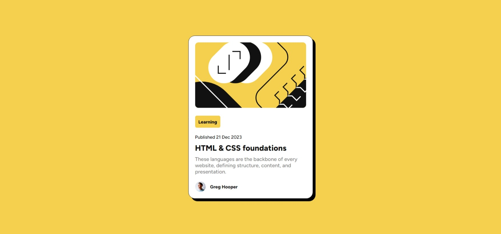

# Frontend Mentor - QR code component solution

This is a solution to the [Blog preview card challenge on Frontend Mentor](https://www.frontendmentor.io/challenges/blog-preview-card-ckPaj01IcS). Frontend Mentor challenges help you improve your coding skills by building realistic projects. 

## Table of contents

- [Overview](#overview)
  - [Screenshot](#screenshot)
  - [Links](#links)
- [My process](#my-process)
  - [Built with](#built-with)
  - [What I learned](#what-i-learned)
  - [Useful resources](#useful-resources)
- [Author](#author)

## Overview

### Screenshot

### Links

- Solution URL: [solution URL](https://github.com/AhmadBinAbdulJabbar/blog-preview-card.git)
- Live Site URL: [live site URL](https://ahmadbinabduljabbar.github.io/blog-preview-card/)

## My process

### Built with

- Semantic HTML5 markup
- CSS custom properties
- Flexbox

### what-i-learned

- html tags
- css styles
- flexbox

### Useful resources

- [web.dev](https://web.dev/learn/html) - For learning html and web development overall.
- [CSS Tricks](https://css-tricks.com/snippets/css/a-guide-to-flexbox/) - This is an amazing article which helped me finally understand flexbox. I'd recommend it to anyone still learning this concept.

## Author

- Github - [@AhmadBinAbdulJabbar](https://github.com/AhmadBinAbdulJabbar)
- Frontend Mentor - [@AhmadBinAbdulJabbar](https://www.frontendmentor.io/profile/AhmadBinAbdulJabbar)
- Twitter - [@AhmadbinAbdulJ1](https://www.twitter.com/AhmadbinAbdulJ1)

